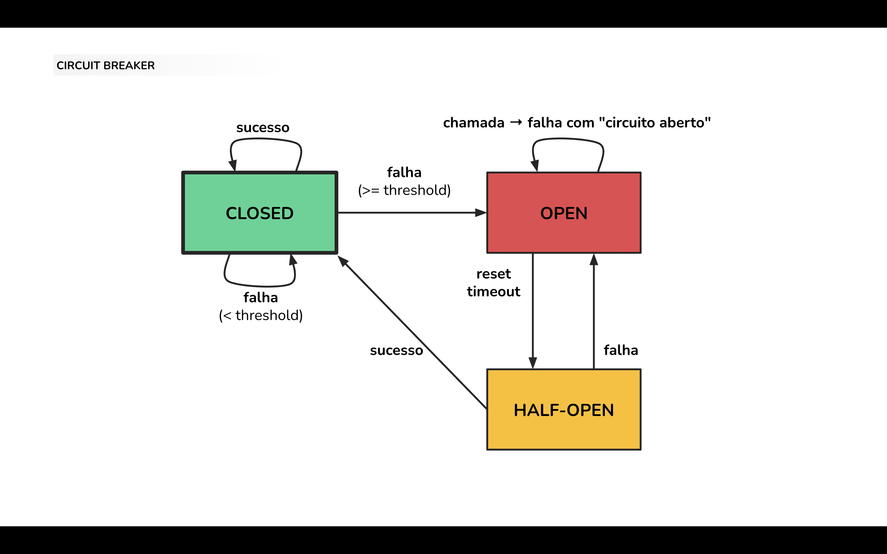

# Patterns de Resiliência: Circuit Breaker

Nessa aula vamos aprender sobre uma técnica para comunicação resiliente entre serviços/sistemas: `circuit breaker`.

Utilizaremos uma série de exemplos com APIs construídas em Node.JS com a infraestrutura _deployada_ localmente utilizando `Docker` e `docker-compose`.

## Exemplos

A aula irá mostrar diferentes maneiras de se implementar o padrão `circuit breaker` através de exemplos:

- [Biblioteca local](./examples/1-lib)
    
    Biblioteca local implementando o padrão de `circuit breaker` sendo utilizada por um serviço BFF para fazer chamada para serviços backend de domínios específicos.

- [Estado distribuído](./examples/2-lib-state)
    
    Biblioteca local implementando o padrão de `circuit breaker` cujo estado é distribuído entre os clientes utilizando um storage centralizado disponível.

- [Proxy reverso](./examples/3-reverse-proxy)
    
    Padrão de `circuit breaker` implementado em proxy reverso entre o serviço cliente e o serviço backend.

## Referências
- https://martinfowler.com/bliki/CircuitBreaker.html
- https://docs.microsoft.com/en-us/azure/architecture/patterns/circuit-breaker
- https://nodeshift.dev/opossum/
- https://github.com/gunnargrosch/circuitbreaker-lambda
- https://www.nginx.com/blog/microservices-reference-architecture-nginx-circuit-breaker-pattern/
- https://github.com/yokawasa/envoy-proxy-demos/tree/master/circuit-breaker
- https://www.haproxy.com/blog/circuit-breaking-haproxy/
- https://istio.io/latest/about/service-mesh/

## Expert

|  |
| :-: |
| [Rodrigo Botti](https://github.com/rodrigobotti) |
